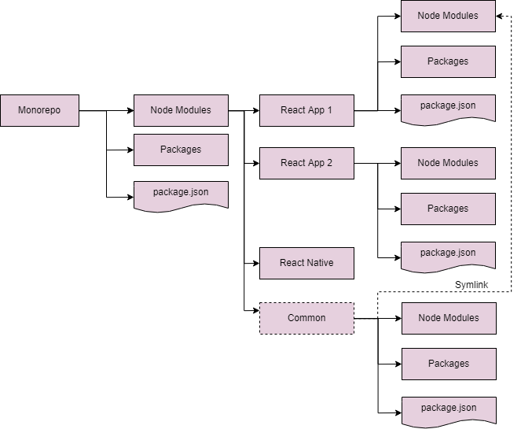

# Monorepo for react & react-native projects with shared code
A monorepo for hosting both React & React Native projects with common code 
shared across. This will maintain specific boundaries for each project separately 
making sure that we don't end up creating a monolith.

Yarn & yarn workspaces are used, scripts needed are provided below.

## Available Scripts

In the project directory, you can run:

## 🚀 Getting Started

- Install `eslint`, `prettier` and `editor config` plugins into your IDE

- Install dependencies on Root

  * yarn

  * yarn run link-mobile

  * yarn run link-web

- For Android on (pocMobile))

  * yarn start

  * yarn run android

- For Web on (pocweb)

  * yarn start
